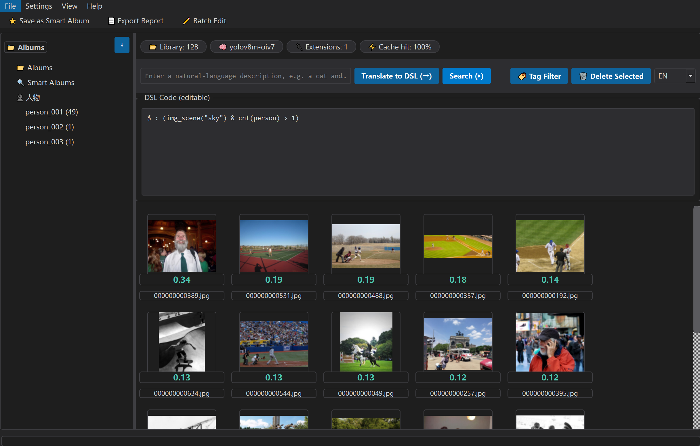
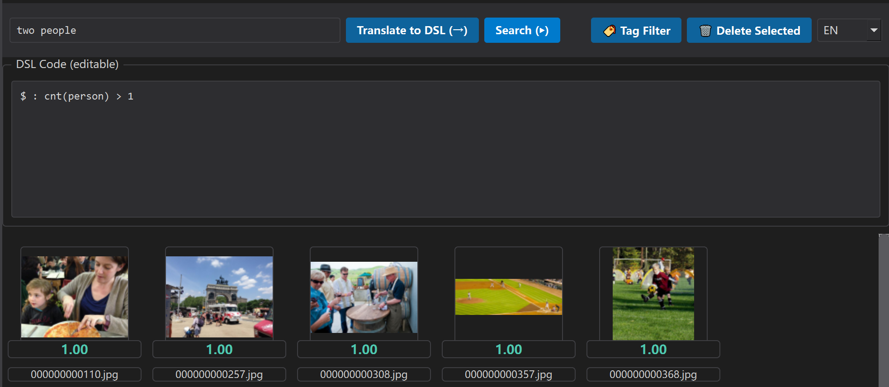
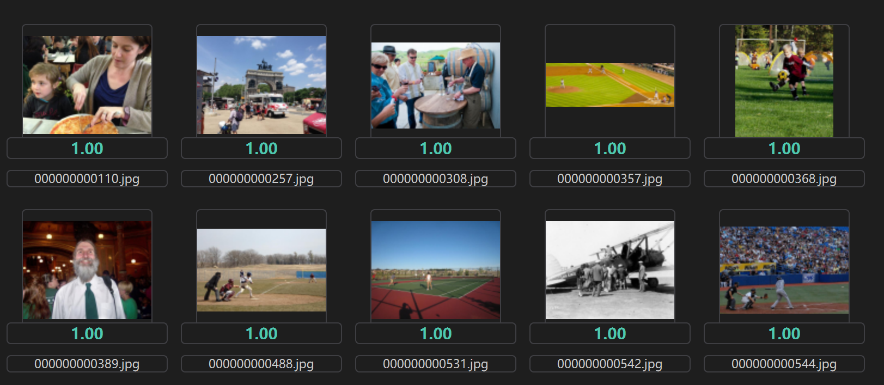
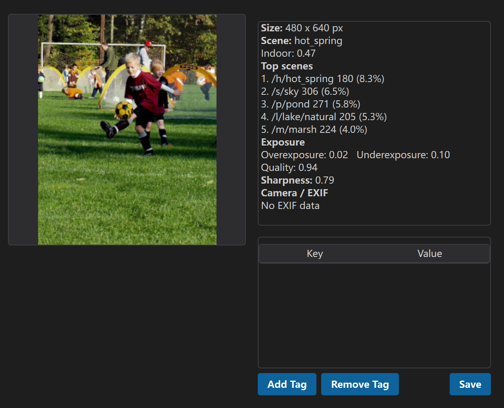
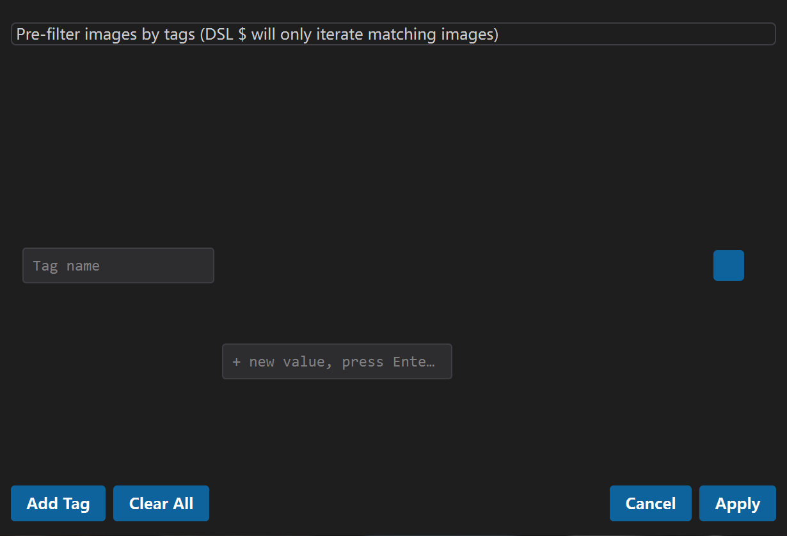
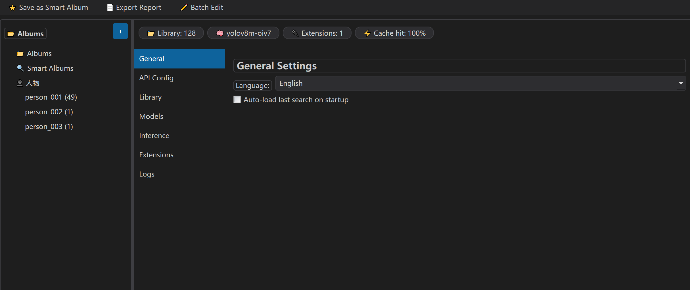
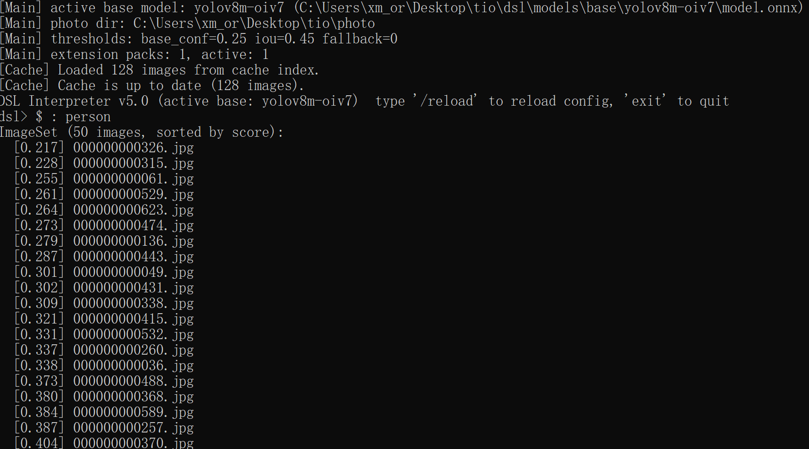

# tio — Image Retrieval DSL Tool

[**English**](README.md) ・ [**中文**](README_zh.md)

> Natural-language image retrieval: **describe → DSL → ranked results**.

[](https://isocpp.org/)
[](https://www.qt.io/)
[](https://github.com/microsoft/onnxruntime)
[](https://github.com/microsoft/onnxruntime)
[](LICENSE)
[](https://github.com/)

A desktop image-retrieval tool made of two parts:

- **GUI** (`gui/`, Qt 6): a natural-language box in, a ranked thumbnail grid out. It calls an
  LLM to translate your sentence into DSL, shows results, and manages the library.
- **Engine** (`dsl/`, C++17): a hand-written DSL interpreter that parses/evaluates queries,
  runs YOLOv8m inference through **ONNX Runtime (CPU)**, and serves an incremental cache.

---

## Screenshots

### Main window



### Natural-language search



### Ranked result grid



### Image detail dialog



### Tag pre-filter dialog



### Settings page



### REPL / CLI



---

## Features

| Feature | Description |
|---------|-------------|
| Natural-language search | Describe an image and the GUI translates it to DSL via an LLM |
| Hand-written recursive-descent parser | No generator; UTF-8 identifiers support Chinese class names |
| YOLOv8m (Open Images V7, 601 classes) detection | ONNX Runtime (CPU-only), incl. `fruit`/`food`/`animal` parent classes |
| Modern filter syntax `$ : (condition)` | Plus `any(...)` / `all(...)` object-level conditions |
| Sets & lift: `%` / `^` / `\| & -` | Object extraction, image lift, union / intersection / difference |
| Inheritance-aware counting `cnt(fruit)` | Also counts `apple`/`banana` subclasses |
| Configurable inference thresholds | base-conf / IoU / fallback, adjustable in the GUI settings page |
| Incremental cache | `cache/<model>/cache_index.json`: only re-infers added/modified files |
| Image attributes | exposure, sharpness, lightweight built-in EXIF reader, editable user tags |
| Places365 scene recognition | Pure C++/ONNX, CPU; queried via `img_scene("beach")` / `img_scene_top()` / `img_is_indoor()` |
| Histogram macros | 32-bin hue histograms: `obj_hist` / `img_hist` / `hist_sim` / `hist_value` |
| Tag pre-filter (GUI dialog + `--tag-filter`) | Restricts `$` to images matching key→value tags (persisted) |
| Asset management | Multi-select delete in the grid, `del` statement in DSL |
| Extension packs `>>` | Crop detected objects and run a fine-grained ONNX model |
| Clustering extension packs (V2) | Embedding models auto-cluster objects (DBSCAN); sidebar people view + rename |
| Unified macro system | math / geometry / relationship / atmosphere macros + user macros |
| Bilingual GUI + dark & light themes | 中文/EN with dark & light themes |

---

## Overview

**tio** is a semantic image-retrieval tool. Instead of keyword matching, you describe what you
want — *"a cat to the left of a dog"* — and the engine ranks images by a fuzzy DSL evaluation.

```
sentence ──► tio.exe (Qt GUI) ──LLM──► DSL code ──QProcess──► dsl.exe (C++ engine)
                                                                    │
                                    ┌───────────────────────────────┤
                                    ▼                               ▼
                    cache/<model>/cache_index.json     models/base/yolov8m-oiv7/model.onnx
                    (incremental cache)                + models/registry.json
```

- The GUI talks to the engine through `QProcess` in `--json` mode: DSL goes in on **stdin**,
  results come back as **JSON on stdout**.
- The engine loads/incrementally updates its cache on startup, then evaluates the DSL.


> **What to capture:** a diagram of the data flow above: user → GUI → LLM → DSL → engine →
> cache (`cache_index.json`) and models (ONNX + registry).

---

## Repository Layout

```
tio/
├── photo/                  # sample gallery (add your own images)
├── dsl/                    # the C++ engine
│   ├── CMakeLists.txt      # MSVC + Ninja + ONNX Runtime
│   ├── cmake/              # Findonnxruntime.cmake
│   ├── include/            # Types / InferenceBackend / ModelRegistry ...
│   ├── src/
│   │   ├── main.cpp        # entry + CLI + --json mode + REPL
│   │   ├── parser/         # Lexer / Parser / AST (hand-written recursive descent)
│   │   ├── executor/       # Evaluator / Context / BuiltinMacros
│   │   ├── cache/          # CacheManager (incremental) + CacheIndex + YoloInference (ONNX)
│   │   ├── scene/          # SceneInference (Places365, ONNX)
│   │   ├── cluster/        # Clustering (DBSCAN over embeddings)
│   │   ├── engine/         # OnnxInference (ONNX Runtime backend)
│   │   └── utils/          # filesystem_utils / exif_reader
│   ├── models/
│   │   ├── registry.json   # active_base / active_extensions
│   │   ├── base/yolov8m-oiv7/   # {model.onnx, meta.json, classes.json}
│   │   ├── extensions/          # extension packs (see extension_pack_format)
│   │   └── scene/          # Places365 (.onnx + categories + meta.json)
│   ├── cache/              # generated at runtime
│   ├── config/             # settings.ini (GUI settings + inference thresholds)
│   ├── docs/               # documentation (EN / 中文)
│   └── gui/                # the Qt GUI
        └── build/          # tio.exe + bundled dsl.exe (auto-deployed by POST_BUILD)
```

---

## Requirements

| Dependency | Requirement |
|------------|-------------|
| C++17 compiler | MSVC 19.5x+ (Visual Studio 2022) |
| CMake ≥ 3.18 | with Ninja or VS generator |
| ONNX Runtime | CPU build `onnxruntime-win-x64-<ver>.zip` from [onnxruntime releases](https://github.com/microsoft/onnxruntime/releases) |
| nlohmann/json | header-only; set `-DNLOHMANN_INCLUDE_DIR` |
| GDI+ / Windowscodecs | Windows system libs (image decoding) |
| Qt 6 (GUI) | 6.10.x MinGW, deploy with `windeployqt` |
| Python 3.10+ (optional) | only for model export `.pt → .onnx` |

---

## Build

### Engine

```powershell
# from a vcvars64 developer prompt:
cd dsl
cmake -B build -G Ninja -DCMAKE_BUILD_TYPE=Release `
      -DONNXRUNTIME_ROOT="D:/path/to/onnxruntime-win-x64-1.29.0" `
      -DNLOHMANN_INCLUDE_DIR="D:/path/to/your-nlohmann-json-include"
cmake --build build
# onnxruntime.dll is copied next to the exe by POST_BUILD
```

### GUI (desktop client)

```powershell
cmake -S gui -B gui/build -G Ninja -DCMAKE_PREFIX_PATH=D:/Qt/6.10.1/mingw_64
cmake --build gui/build
# POST_BUILD copies dsl.exe + onnxruntime.dll and runs windeployqt
```

Run: double-click `gui/build/tio.exe`.


> **What to capture:** the app as launched from `gui/build/tio.exe`.

---

## Model Export (.pt → .onnx)

The engine only loads `.onnx` models. Export a YOLOv8 checkpoint with the official `yolo export`
CLI:

```powershell
yolo export model=yolov8m-oiv7.pt format=onnx opset=12 imgsz=640
```

A registered base model needs `model.onnx` + `meta.json` + `classes.json` under
`models/base/<name>/` (see [base_model_pack_format.md](dsl/docs/base_model_pack_format.md)).

---

## Quick Start

### CLI

```powershell
build\dsl.exe                      # interactive REPL
build\dsl.exe --list-models        # list registered models
build\dsl.exe --base yolov8m-oiv7  # override the active base model
build\dsl.exe --json --photo .\photo --tag-filter "city=sh" < query.dsl
```

### REPL examples (modern syntax)

```dsl
dsl> $ : (any(class == "person"))              # images with a person
dsl> % $ : (any(class == "person"))            # extract person objects
dsl> $ : (cnt(fruit) > 2)                      # >2 fruit (incl. subclasses)
dsl> $ : (img_warmth() > 0.7 && any(class == "cat"))   # warm and has a cat
dsl> people = % $ : (any(class == "person"))
dsl> parts = people >> person_parts_v1         # fine-grained refinement
dsl> ^ parts                                   # lift back to images
dsl> /reload                                   # hot-reload registry.json
```

> The legacy quantifier syntax `$ any (cond)` remains backward-compatible; new code should use
> `$ : (cond)` + `any()`/`all()`.


> **What to capture:** a REPL session running the example queries above.

---

## Tag Pre-Filter & Asset Management

**Tag pre-filter** restricts the whole query to images whose `user_tags` match all given
key→value conditions (values are OR-ed). In the GUI, press **🏷️ Tag Filter** to build the
conditions in a dialog; the filter is persisted across restarts.

```powershell
# CLI equivalent:
dsl.exe --json --photo .\photo --tag-filter "city=sh|bj" --tag-filter "level=3"
dsl.exe --json --photo .\photo --tag-filter "location="    # any value for location
```

An active filter matching nothing yields **zero** results (it never silently falls back to the
whole library).

**Asset management**:
- In the grid, multi-select thumbnails (Ctrl/Shift) and press **🗑 Delete Selected** to delete
  files + remove their cache entries.
- In DSL, `del <path>` / `del <image-set expression>` / `del <variable>` deletes images.


> **What to capture:** the tag filter dialog with conditions like `city=sh` and `level=3`.

---

## DSL Cheat Sheet

| Syntax | Meaning |
|--------|---------|
| `$` | the whole library (or the current image inside a quantifier) |
| `$ : (cond)` | filter images where `cond` holds |
| `any(cond)` / `all(cond)` | existential / universal object condition |
| `%` | extract objects: ImageSet → ObjectSet |
| `^` | lift images: ObjectSet → ImageSet (dedup) |
| `\| & -` | union / intersection / difference |
| `>> pack` | run an extension model on matching objects |
| `cnt(cls)` | count objects of `cls` incl. subclasses |
| `macro f(x)=expr` | define a user macro |
| `collection("name")` | virtual album (managed by the GUI) as an ImageSet |
| `cluster_id(obj, "c")` / `cluster_sim(a, b, "c")` | clustering macros (V2) |

Object properties: `class` `x` `y` `w` `h` `area` `confidence` `super_class` `original_class`.
Attribute macros: `big` `small` `left` `right` `top` `bottom` `square`, `left_of` `above`
`inside`, `warm` `cool` `bright` `dark` `smooth` `rough`; math `max/min/abs/sqrt/pow/log/exp`.

Image macros: `img_warmth()` `img_bright()` `img_color()` `img_blur()` `img_over()` `img_under()`
`img_exp_good()` `img_camera()` `img_iso()` `img_shutter()` `img_aperture()` `img_fl()`
`img_date()` `img_tag(k)` `img_has_tag(k)` `img_tag_equals(k,v)` `img_scene(name)`
`img_scene_top()` `img_is_indoor()` `obj_hist(o)` `img_hist()` `hist_sim(A,B)` `hist_value(o,i)`
`img_hist_value(i)` `stof(s)` `str_contains(s,sub)`.

---

## Documentation

Documentation is bilingual (English / 中文). Each page has a language switch at the top.

| Document | Description |
|----------|-------------|
| [dsl_reference.md](dsl/docs/dsl_reference.md) | full DSL language reference |
| [usage_tutorial.md](dsl/docs/usage_tutorial.md) | usage tutorial |
| [architecture.md](dsl/docs/architecture.md) | architecture overview |
| [base_model_pack_format.md](dsl/docs/base_model_pack_format.md) | base model pack format |
| [extension_pack_format.md](dsl/docs/extension_pack_format.md) | extension pack format (incl. clustering V2) |
| [handover.md](dsl/docs/handover.md) | team handover / known issues |

---

## Roadmap

- [ ] Extension-pack demos + docs for `>>` refinement
- [ ] Linux / macOS engine builds (ONNX Runtime is cross-platform)
- [ ] Open-vocabulary base models (YOLO-World style, dynamic classes)
- [ ] GPU inference option

---

## License

This project is licensed under the **GNU General Public License v3.0** — see [LICENSE](LICENSE).
